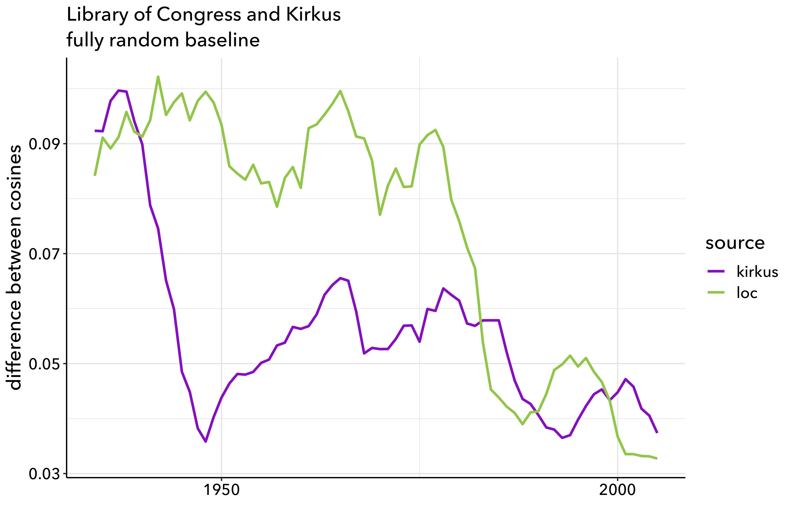

Experiment on Library of Congress genre categories
==================================================

You'll notice a lot of files in this folder are labeled "loc2." This is the second pass at the Library of Congress experiment. (We're not cherry-picking; our pre-registered hypotheses were also confirmed in the first pass, but we had some doubts about possible confounding variables and decided to run it again more carefully.)

This pass at the question differs by using the Delta normalization instead of tf-idf, by excluding very short vols of fiction (and downsampling long ones), and by manually excluding vols that are clearly not fiction.

selectionprocess
----------------

Scripts used to select volumes and construct metadata.

Code
----

**make_loc_delta.py** constructs word vectors of length 2500 and standardizes them using Burrows' Delta (which is effectively equivalent to the Standard Scaler in scikit-learn). This script will only run if you download the required extracted feature files from HTRC.

Alternatively, you could just borrow our vectors; the matrix is too large for a git repo but can be downloaded as [https://www.dropbox.com/s/4gf1y9r5iqxdafo/delta_matrix_loc2.tsv?dl=0](https://www.dropbox.com/s/4gf1y9r5iqxdafo/delta_matrix_loc2.tsv?dl=0)

**measure_loc2_distances.py** is the central script in this experiment; it actually selects pairs of volumes and measures distances.

**test_multigenre_weakness.py** tests a hypothesis about confounding variables that worried us briefly: do volumes with multiple genre tags belong to their individual genres less strongly than volumes with only one tag? The answer is: only very faintly——not enough to produce the pattern observed in our experiment.

**SonicScrewdriver.py** is just a set of utility functions I keep around, especially for dealing with pairtree filenames.

Metadata
--------

**filtered_meta_4loc2.tsv** is the main metadata file for this experiment.

**taggedparts/all2remove.tsv** is a list of volumes we decided weren't really fiction.

Results
-------

Here the key file is **annotated_loc2_delta_results3.tsv**, which we concede is a terrible name.

rplots
------

Contains images used in the paper, and the R scripts that produced them.

It also contains two images that we didn't have room for in the paper, that could be fairly illuminating. These superimpose the LoC and Kirkus trend lines in the period where they overlap. First, the other-genre baseline.

Also, the fully random baseline:

